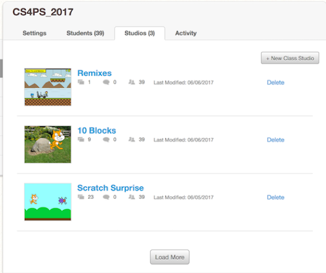
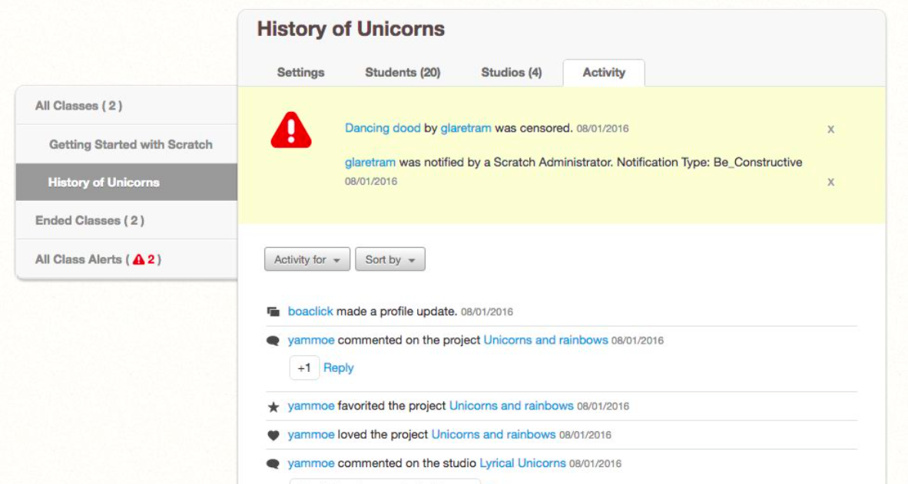

# Scratch Teacher Accounts

## Coding in Stage 3: {Stream_Title}

### Mr Daniel Hickmott & {Stream_Presenter}

#### Week 2: Teaching Coding with Scratch

##### {Stream_Date} May 2018

---

## Teacher Accounts

- *Teacher Accounts*
- *Creating Class Studios*
- *Remixing Projects*

---

## Teacher Accounts

- We highly recommend getting a *Teacher Account* for managing your classes
- These are a special type of accounts that you have to request through the Scratch website that can help save your time
- The {Stream_Materials} were written before *Teacher Accounts* were made available
- We will give some examples of how the {Stream_Materials} activities can be used with *Teacher Accounts* as we move through the program

---

## Teacher Accounts

- In this activity, you will learn about some important *Teacher Accounts* concepts:
	- *Student Accounts*
	- *Classes* & *Class Studios*
	- *Remixing Projects*
- Steps are also in the **Managing Classes with Scratch Teacher Accounts** activity.

---

## Concepts: Student Accounts

- a *Student Account* belongs to one *Class*
- Also don't need an email address to create them
- View Students' activity and shared projects
- Reset their passwords

---

## Concepts: Classes

- A collection of *Student Accounts*
- Cannot add existing Scratch accounts to a *Class*
- Sharing *Teacher Accounts* (e.g. with an ICT teacher)
- How do you use these (if you use them already)?

---

## Adding a New Class

- Please log into your *Teacher Account*
- *My Classes*: See all the Classes that you have created
- Click *+ New Class* button to create a new *Class*
- Be careful with naming Classes (for privacy reasons)

---

## Adding Students to a Class

- 3 main ways to do this:
	- Adding Students with the *+ New Student* button
	- Creating a Student *Sign-up Link*
	- Adding Students with *CSV Upload*

---

## New Student Button

- In the *Students* tab, click the *+ New Student* button
- Adding a common name as a New Student
- We often use a combination of a colour, animal, number and a suffix (CS4S)
	- end up with names like: BlueDog2_CS4S

---

## New Student Button - Sign in as Student

- Open a different web browser and go to [scratch.mit.edu](scratch.mit.edu)
- Log in with the new student account you created
- The password will be your Teacher Account's username (e.g. my Teacher Account name and the student's password is *hckm*)
- Good for creating a smaller number of students, may not be ideal for 20+ students

---

## Student Sign-up Link

- You create a link
- You could email this out to students or give students the link
- Student chooses the username and password when they sign in

---

## CSV Upload

- A good way to create lots of students at once, using a csv file
- More instructions in the activity
- You choose the username and the password
- We use this approach for workshops - explained in *Extension* activity

---

## Creating Students

- 3 main ways to do this:
	- Adding Students with the *+ New Student* button
	- Creating a Student *Sign-up Link*
	- Adding Students with *CSV Upload*
- Each approach has their advantages and disadvantages

---

## Concept: Class Studios

- Studios are a collection of *Projects*
- Really good for sharing *Projects*
- Can also be used when assessing tasks

---

## Concept: Class Studios

---

## Create a Class Studio

- We will now create a Studio
- Let's call it *Interesting Projects*
- Can add your own and others projects to *Studios*
- Projects have to be *shared* to be added to a *Studio*

---

## Add a Project to a Studio

- 2 main ways:
	1.	From the *Studio* page, with the *Add projects* button
	2.	From a project's page, with the *Studios* button
- Let's find an interesting project through *Explore*

---

## View Students' Activity

- When using a *Teacher Account* you can see when students:
	- shares a project
	- comments on a project
	- loves a project
	- favourites a project

---

## All Class Alerts

- You can also see alerts for some activity (account deletion and reporting)

---

## Changing Students' Passwords

1. *Prompt Student*: 
	- changes password to your Teacher Account's username (e.g. *hckm*)
	- student logs in with that password and is then asked to change it
2. *Manually Change*: 
	- you choose the password for the student's account
	- student logs in with that password

---

## Deleting Student Accounts

- Currently only 1 option: log in as the student & request to delete the account
- Also able to *End Classes*
	- projects and studios from the *Class* are still available
	- students can not log in to their accounts while the class is ended

---

# Remixing Projects

- You will learn more about these 

---

# What is Remixing?

---

# The Remix Tree

---

## Remixing with Teacher Accounts

1. Create a Studio for the Task
2. Create a project or remix one
3. Share the project
4. Add it to the Studio

---

## Remixing as a Student

1. Go to the Class Studio
2. Find the Task Project
3. Remix it
4. Share it
5. Add it to the Studio

