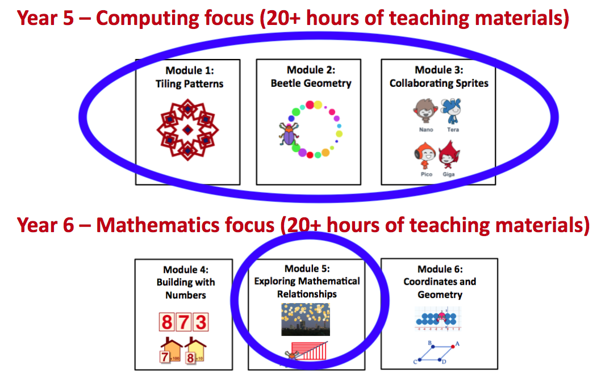

# Introduction to Tiling Patterns

## Coding in Stage 3: ScratchMaths

### Mr Daniel Hickmott & Dr Elena Prieto-Rodriguez

#### Week 3: Tiling Patterns Part 1

##### 28th May 2018

---

## ScratchMaths

*"Here’s the big idea. Maths is difficult in part because of the language in which it is expressed. Can we find a different language – and set of ideas and approaches - that is more open, more accessible and more learnable? And can we find it without sacrificing what makes mathematics work? Our tentative answer is 'yes' – the language of programming might – if we design it right – be just such a language."* - UCL ScratchMaths Homepage

---

##  ScratchMaths

- Resources for teaching Coding alongside Mathematics
- Developed by researchers at UCL and teachers from England
- 2 year curriculum for Years 5 and 6 in England (Years 4 and 5 here)
- Includes references to Mathematics and Computing Curriculum outcomes and concepts

--- 

## ScratchMaths: Research

- Over 100 schools in England trialling ScratchMaths
- Studies are being conducted that investigate how students learn Coding concepts alongside Mathematics
- Similar research conducted with the Logo language in the 1980s and 1990s
- Recent, "renewed" interest in this area (e.g. including Coding in STEM)

---

## ScratchMaths Resources

- [Available to download from the UCL Website for free](http://www.ucl.ac.uk/ioe/research/projects/scratchmaths)
- *Curriculum Materials* section
- We will also have these materials for the relevant module on the website each week
- You can also download all of the materials for a *Module* at once or 1-by-1

---

---

## Module Contents

- Each Module has:
	- Teacher Materials
	- Investigations
	- Activities
	- Starter Scratch Projects
	- Challenges

---

## Module 1: Tiling Patterns

- Focused on creating repeating patterns in Scratch
- Includes learning about:
	- **Computational Concepts:** *Sequences* and *Loops*
	- **Mathematics Concepts:** *Symmetry*, *Angles*, *Patterns*, *Co-ordinates*, and *Positive and Negative Numbers*
- [Teacher Materials](http://www.ucl.ac.uk/ioe/research/projects/scratchmaths/curriculum-materials/module-1-tiling-patterns/files/SM_Y5_Module_1_Teacher_Materials.pdf) with Investigations and Activities
- Content could be linked to Creative Arts ([Islamic Art](https://www.google.com/search?safe=off&client=firefox-b-ab&biw=1920&bih=973&tbm=isch&sa=1&ei=vmIGW4WNN4qO8gWx-7egAw&q=islamic+art&oq=islamic+art&gs_l=img.3...0.0.0.24133.0.0.0.0.0.0.0.0..0.0....0...1c..64.img..0.0.0....0.carWxtRFgyQ))

---

##  Module 1: Tiling Patterns

- The *Success Criteria* for Module 1 are on the last page of the [Module 1 Teacher Materials](https://drive.google.com/uc?export=view&id=1Erf3U2n6Oc4G0vEI-eBQ4lbTroB8arD_)
- There are 4 Investigations in Module 1
- In this session, we will aim to get the first 2 Investigations completed:
	-  *Moving, Turning and Stamping* (4 Activities)
	-  *Repeat and Alternating Patterns* (3 Activities plus 1 Extension Activity)

--- 

## Walkthrough: Creating and Sharing Activities

- The ScratchMaths materials' instructions do not involve steps for using *Teacher Accounts*
- The method I will use for setting up activities involves using my *Scratch Teacher Account* + you *Remixing* with your Student Account
- I will demonstrate how I set up the Activities
- I will also demonstrate how we would like you to share your projects