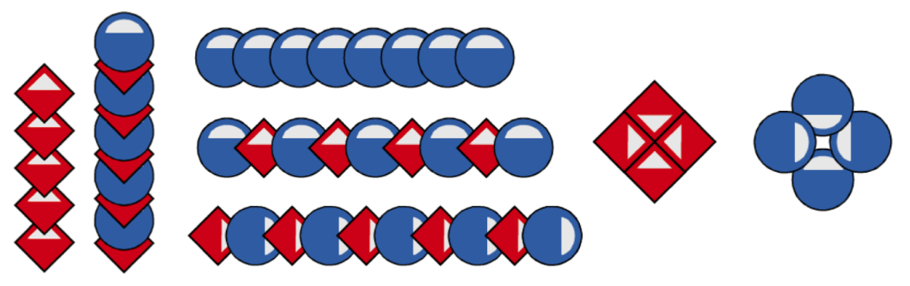

# Session Wrap-up

## Coding in Stage 3: ScratchMaths

### Mr Daniel Hickmott & Dr Elena Prieto-Rodriguez

#### Week 3: Tiling Patterns Part 1

##### 25th May 2018

---

## Recap: ScratchMaths Resources

- Introduced you to the *ScratchMaths* resources
- Resources that aim to teach Coding alongside Mathematics in Scratch
- *Teacher Materials*, *Presentations* and *Starter Scratch Projects*
- *Modules*, *Investigations* and *Activities*

---

## Recap: Remixing ScratchMaths Activities

- I demonstrated how you can add ScratchMaths activities to a *Class Studio*
- Showed you how to remix the activity with a *Student Account*
- You could use this approach (or a similar approach) with your students to set up activities

---

## Recap: Tiling Patterns

- We started the first Module: *Tiling Patterns*
- Includes learning about:
	- **Computational Concepts:** *Sequences* and *Loops*
	- **Mathematics Concepts:** *Symmetry*, *Angles*, *Patterns*, *Co-ordinates*, and *Positive and Negative Numbers*

---

## Homework Tasks

- Every week we will ask you to complete Homework
- Contributes towards your NESA accreditation hours (each week is 1 hour, for a total of 10 hours)
- After you have finished, please email me and let me know, so I can record this
- The tasks and links to complete this homework will always be available on the session page, under the *Homework* heading 	

---

## Week 3 Tasks

1. Choose 2 of the patterns below
2. Remix the project in the *1.2.4 Week 3 Homework* Studio and create a project that draws the 2 patterns after *space key pressed* and *when this sprite clicked*

---

## Next Week: Tiling Patterns Part 2

- We will continue with the *Tiling Patterns* module
- Investigations 3 and 4:
	-  *Creating Circular Rose Patterns*
	-  *Defining Your Own Pattern Blocks*

---

## Journal

- Please complete a Journal entry before you leave today (should take 5-10 minutes)
- Link to Weekly Journal survey is on the session page, under the *Links* heading
- Or go to [hckmd.com/journal](hckmd.com/journal)
- **Before you leave: please Logoff and return Nametag**
