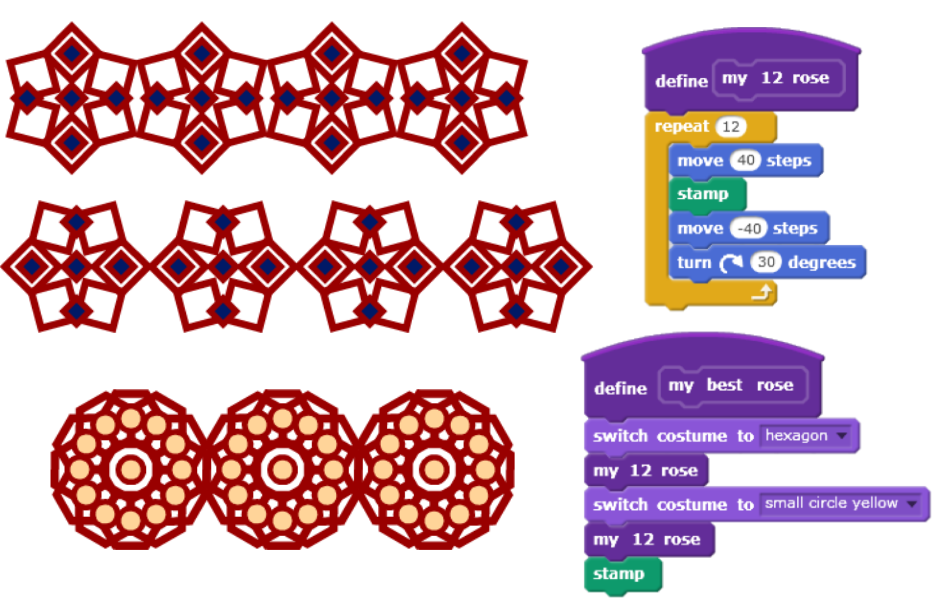
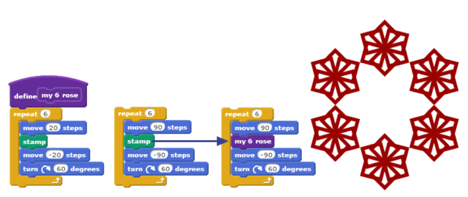

# Session Wrap-up

## Coding in Stage 3: ScratchMaths

### Mr Daniel Hickmott & Dr Elena Prieto-Rodriguez

#### Week 4: Tiling Patterns Part 2

##### 4th June 2018

---

# Recap: Tiling Patterns

- We finished the first Module: *Tiling Patterns*
- Included learning about:
	- **Computational Concepts:** *Sequences* and *Loops*
	- **Mathematics Concepts:** *Symmetry*, *Angles*, *Patterns*, *Co-ordinates*, and *Positive and Negative Numbers*

---

# Homework Tasks

- Every week we will ask you to complete Homework
- Contributes towards your NESA accreditation hours (each week is 1 hour, for a total of 10 hours)
- After you have finished, please email me and let me know, so I can record this
- The tasks and links to complete this homework will always be available on the session page, under the *Homework* heading 	

---

# Week 4: 5 Main Tasks

1. (Optional) Remix the Rose Patterns project
2. Add Code to draw a "Row of Roses"
3. Add Code to draw a "Rose of Roses"
4. Add *User Input* to draw the different patterns
5. Share the project add to *Week 4 Homework Class Studio*

---

# Task 1: Remix the Project

- (Optional) - you can continue in the project you created today instead
- The *ORIGINAL - Rose Patterns* project in the *ScratchMaths Rose Patterns* Class Studio
- This will set you up with the right *Sprite* and *Costumes*

---

# Task 2: Add Code for "Row of Roses"

---

# Task 3: Add Code for "Rose of Roses"

---

# Task 4: Add User Input

---

# Task 5: Add to Week 4 Homework Class Studio

- I have created a studio called *ScratchMaths Week 4 Homework*
- Once you are finished Task 4
	- Share the project
	- Add it to the Studio
	- Let me know via email that you are finished

---

# Next Week: Beetle Geometry Part 1

- We will start the *Beetle Geometry* module
- That module involves learning how to use the *Pen* tool
- We will draw scenes with Coding: *Sequences* & *Loops*
- Also use Maths concepts: *Perimeter*, *Shapes*, *Roman Numerals* and *Probability*

---

## Journal

- Please complete a Journal entry before you leave today (should take 5-10 minutes)
- Link to Weekly Journal survey is on the session page, under the *Links* heading
- Or go to [hckmd.com/journal](hckmd.com/journal)
- **Before you leave: please Logoff and return Nametag**
