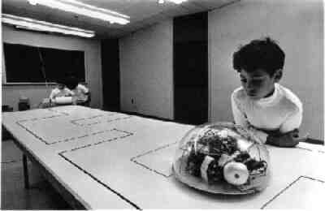

# Introduction to Beetle Geometry

## Coding in Stage 3: ScratchMaths

### Mr Daniel Hickmott & Dr Elena Prieto-Rodriguez

#### Week 5: Beetle Geometry Part 1

##### 12th June 2018

---

# Module 2: Beetle Geometry

- Last week we completed *Module 1: Tiling Patterns*
- Involved *Sequences* and *Loops* for creating repeating patterns
- Today we will start on *Module 2: Beetle Geometry*
- These activities also involve *Geometry*, for example: calculating angles and drawing shapes

---

# Module 2: Beetle Geometry

- Drawing shapes with the *pen* tool in Scratch
- Includes learning about:
	- **Computational Concepts:** *Sequences*, *Loops* and *Operators*
	- **Mathematics Concepts:** *Shapes* and their *perimeters*, *Roman Numerals* and *Probability*
- [Teacher Materials](http://www.ucl.ac.uk/ioe/research/projects/scratchmaths/curriculum-materials/module-1-tiling-patterns/files/SM_Y5_Module_1_Teacher_Materials.pdf) with Investigations and Activities

---

---

#  Module 2: Beetle Geometry

- The *Success Criteria* for Module 2 are on the last page of the [Module 2 Teacher Materials](https://drive.google.com/uc?export=view&id=1a6asI3r-V8Okub8-deUy2yzWsdn2JM21)
- There are 4 Investigations in Module 2
- In this session, we will aim to get the first 2 Investigations completed:
	-  *Exploring Pen* (4 Activities)
	-  *Drawing Polygons* (4 Activities)

--- 

# Walkthrough: Remixing and Sharing Activities

- The ScratchMaths materials' instructions do not involve steps for using *Teacher Accounts*
- The method I will use for setting up activities involves using my *Scratch Teacher Account* + you *Remixing* with your Student Account
- I will also demonstrate how we would like you to share your projects

