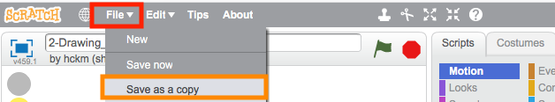
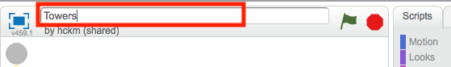
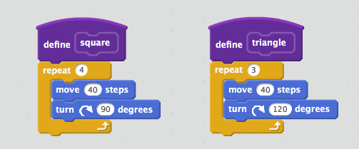
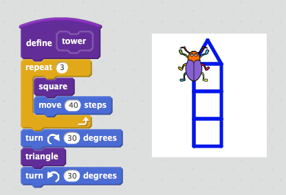
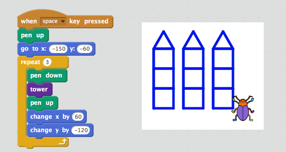
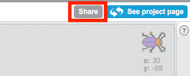

# Session Wrap-up

## Coding in Stage 3: ScratchMaths

### Mr Daniel Hickmott & Dr Elena Prieto-Rodriguez

#### Week 5: Beetle Geometry Part 1

##### 12th June 2018

---

# Recap: Beetle Geometry Part 1

- We started *Module 2: Beetle Geometry*
- Includes learning about:
	- **Computational Concepts:** *Sequences*, *Operators* and *Loops*
	- **Mathematics Concepts:** *Shapes* and their *Perimeters*, *Roman Numerals* and *Probability*

---

# Homework Tasks

- Every week we will ask you to complete Homework
- Contributes towards your NESA accreditation hours (each week is 1 hour, for a total of 10 hours)
- After you have finished, please email me and let me know, so I can record this
- The tasks and links to complete this homework will always be available on the session page, under the *Homework* heading 	

---

# Week 5 Homework: Draw Three Towers

1. Take a copy of the *2-Drawing Polygons* project and call it *Tower*
2. Create *square* and *triangle* custom blocks
3. Create a *tower* custom block
4. Add blocks to draw three towers on the stage when the *space bar is pressed*
5. Share the completed project and add it to the *Week 5 Homework Class Studio*

---

Step 1: Take a Copy of the *Drawing Polygons* Project

... and name it *Towers*

---

Step 2: Create *square* & *triangle* Custom Blocks

---

Step 3: Create a *tower* Custom Block

---

Step 4: Add Blocks to Draw Three Towers

---

Step 5: Share & Add to Homework Studio

... & add it to the *Maths Week 5 Homework* Class Studio

---

# Next Week: Beetle Geometry Part 2

- We will continue with the *Beetle Geometry* module
- Investigations 3 and 4:
	-  *Discovering Dots*
	-  *Pen Project: Nature Scenes*

---

# Journal

- Please complete a Journal entry before you leave today (should take 5-10 minutes)
- Link to Weekly Journal survey is on the session page, under the *Links* heading
- Or go to [hckmd.com/journal](hckmd.com/journal)
- **Before you leave: please Logoff and return Nametag**
