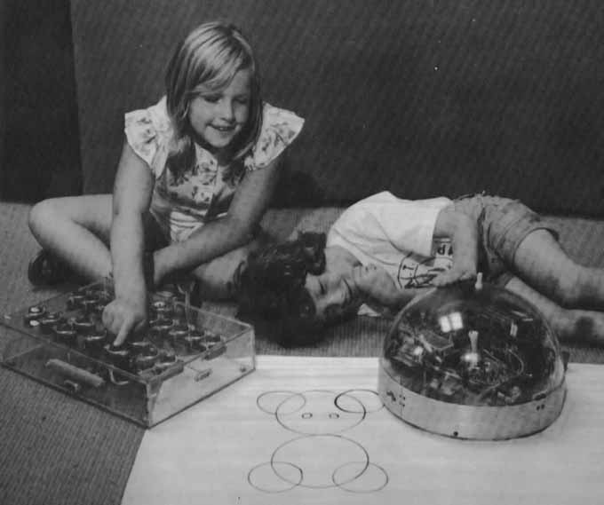

# Recap
# Beetle Geometry Part 1

## Coding in Stage 3: ScratchMaths

### Mr Daniel Hickmott & Dr Elena Prieto-Rodriguez

#### Week 6: Beetle Geometry Part 2

##### 18th June 2018

---

# Last Session

- Started working through ScratchMaths Module 2: *Beetle Geometry*
- *Teacher Materials*, *Presentations* and *Starter Scratch Projects*
- *Investigations* and *Activities*

---

# Module 2: Beetle Geometry

- Drawing shapes with the *pen* tool in Scratch
- Includes learning about:
	- **Computational Concepts:** *Sequences*, *Loops* and *Operators*
	- **Mathematics Concepts:** *Shapes* and their *perimeters*, *Roman Numerals* and *Probability*
- [Teacher Materials](http://www.ucl.ac.uk/ioe/research/projects/scratchmaths/curriculum-materials/module-1-tiling-patterns/files/SM_Y5_Module_1_Teacher_Materials.pdf) with Investigations and Activities

---

---

# Module 2: Beetle Geometry

- Last week we did the first two Investigations from Module 2
    - *Exploring Pen* and *Drawing Polygons*
- Calculating angles and using *repeat* to draw polygons
- Created custom blocks for drawing *triangles*, *squares* and *towers*
- Made our Beetle jump to different positions on the Stage

---

# Module 2: Beetle Geometry

- The *Success Criteria* for Module 2 are on the last page of the [Module 2 Teacher Materials](https://drive.google.com/uc?export=view&id=1wYThHoxBJHoTq2GzUgvsuEQvXPrUxRIW)
- There are 4 Investigations in Module 2
- In this session, we will aim to get the last 2 Investigations completed:
	-  *Discovering Dots* (4 Activities)
	-  *Pen Projects: Nature Scenes* (2 Activities plus 2 Extension Activities)
