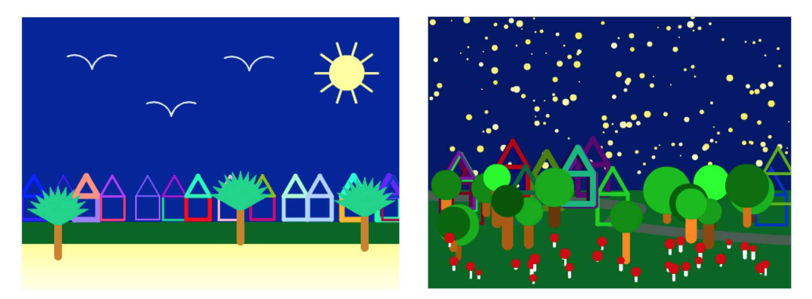
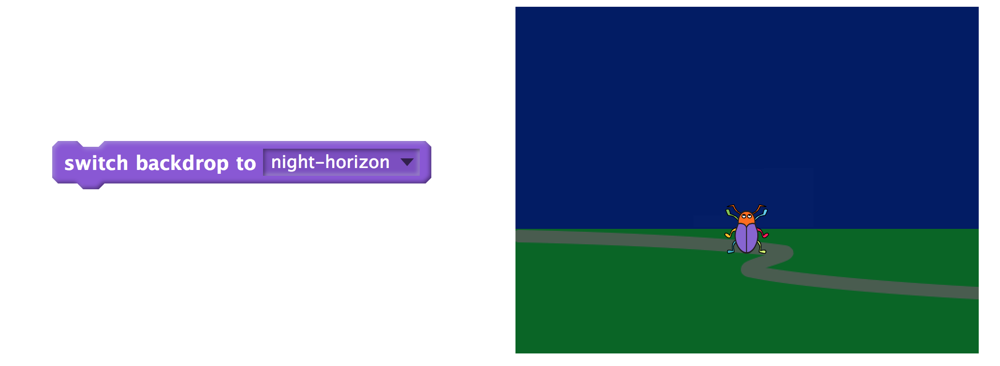
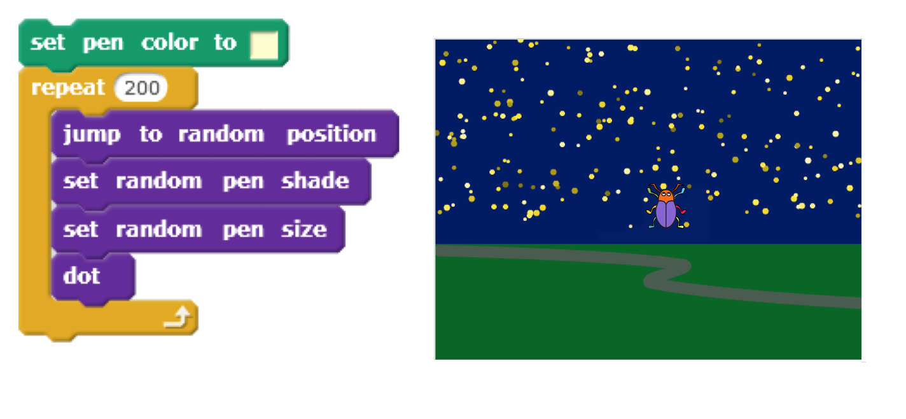
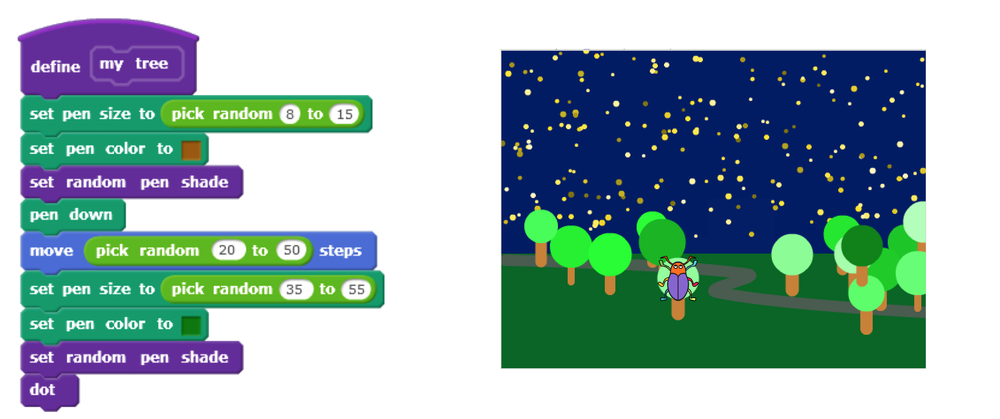
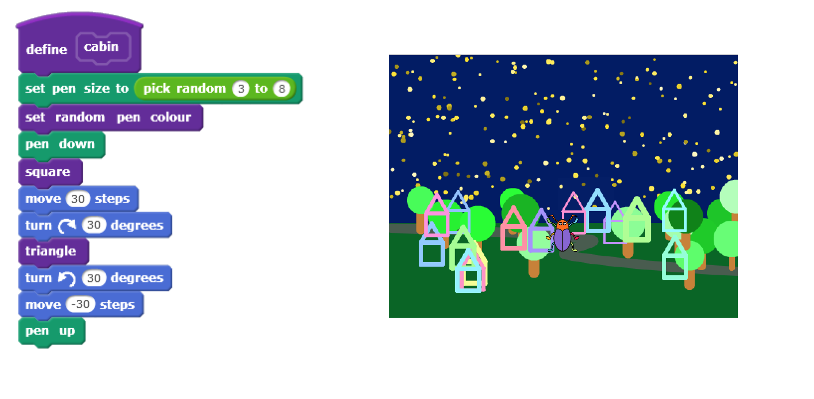
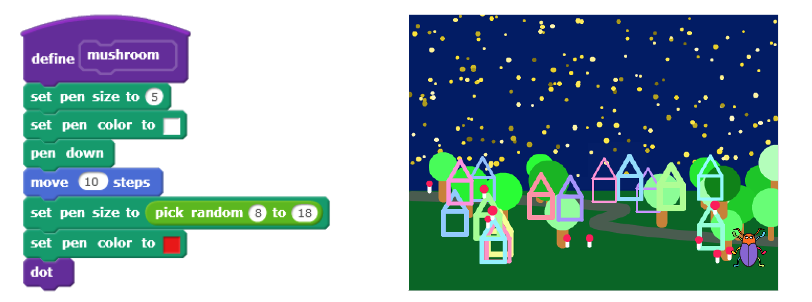

# Session Wrap-up

## Coding in Stage 3: ScratchMaths

### Mr Daniel Hickmott & Dr Elena Prieto-Rodriguez

#### Week 6: Beetle Geometry Part 2

##### 18th June 2018

---

# Recap: Beetle Geometry

- We finished the second Module: *Beetle Geometry*
- Included learning about:
	- **Computational Concepts:** *Sequences*, *Loops* and *Operators*
	- **Mathematics Concepts:** *Shapes* and their *perimeters*, *Roman Numerals* and *Probability*

---

# Homework Tasks

- Every week we will ask you to complete Homework
- Contributes towards your NESA accreditation hours (each week is 1 hour, for a total of 10 hours)
- After you have finished, please email me and let me know, so I can record this
- The tasks and links to complete this homework will always be available on the session page, under the *Homework* heading 	

---

# Week 6 Homework: Nature Scenes

- Choose one of the extension activities from the Beetle Geometry module

---

# Week 6 Homework: Nature Scenes

- Create blocks that draw a *Nature Scene* or *Life's a Beach* picture
- There are instructions about how to draw these in the [Teacher Materials](https://drive.google.com/uc?export=view&id=1wYThHoxBJHoTq2GzUgvsuEQvXPrUxRIW)
- Have also included some steps to draw some of the parts of the scene in the *Week 6 Homework Task* document
- Also have a video that shows a scene being drawn - [Nature Scene: A Walk in the Woods Example Video](https://drive.google.com/uc?export=view&id=1m_Ykfefj12r5DHBAnb7Xh8pv7-lAYAvA)

---

# Week 6: 5 Main Tasks

1. (Optional) Remix the "2-Pen project" project
2. Switch the backdrop to "night-horizon"
3. Draw stars in random spots in the sky
4. Draw trees, cabins and mushrooms in random spots on the ground
5. Share the project and add it to the *Week 6 Homework Class Studio*

---

# Task 1: Remix the Project

- (Optional) - you can continue in the project you created today instead
- The *2-Pen project* project is in the *MATHS 2.4.1 Drawing Trees* Class Studio
- This will set you up with the right *Sprite* and *Backdrops* for the activity

---

# Task 2: Switch the Backdrop

---

# Task 3: Draw Stars in the Sky

---

# Task 4.1: Draw trees

---

# Task 4.2 Draw cabins

---

# Task 4.3 Draw mushrooms

---

# Task 5: Add to Week 6 Homework Class Studio

- I have created a studio called *MATHS Week 6 Homework*
- Once you are finished your Nature Scene:
	- Share the project
	- Add it to the Studio
	- Let me know via email that you are finished

---

# Next Week: Interacting Sprites Part 1

- We will start the *Interacting Sprites* module
- That module involves learning how to create interactions with Sprites
- We will create stories with Coding, using **Computational Concepts**: *Sequences*, *Loops*, *Parallelism*, *Events* and *Operators*
- Also use **Mathematics** concepts: *Coordinates*, *Positive and Negative Numbers*, *Multiplication and Division* and *Probability*

---

# Journal

- Please complete a Journal entry before you leave today (should take 5-10 minutes)
- Link to Weekly Journal survey is on the session page, under the *Links* heading
- Or go to [hckmd.com/journal](hckmd.com/journal)
- **Before you leave: please Logoff and return Nametag**
