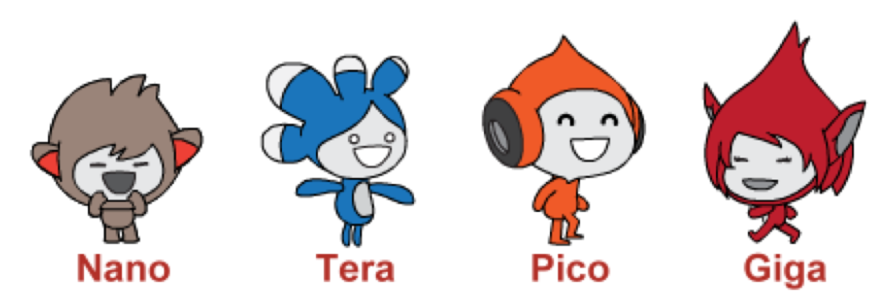

# Intro to Interacting Sprites

## Coding in Stage 3: ScratchMaths

### Mr Daniel Hickmott & Dr Elena Prieto-Rodriguez

#### Week 7: Interacting Sprites Part 1

##### 25th June 2018

---

# Module 3: Interacting Sprites

- Last week we completed *Module 2: Beetle Geometry*
- Involved *Sequences*, *Loops* & *Operators* for drawing shapes and scenes with Scratch's *pen* blocks
- Today we will start on *Module 3: Interacting Sprites*
- *Module 3* involves creating projects that involves multiple Sprites interacting with each other
	- collisions, conversations and Stories

---

# Module 3: Characters

- Scratch has libraries of *Sprites*, *Backdrops* and *Sounds*
- You will learn about these and how they can be used for *Digital Storytelling*

---

# Module 3: Interacting Sprites

- Includes learning about:
	- **Computational Concepts:** focus on *Events*, *Parallelism* and *Conditionals*
	- **Mathematics Concepts:** *Co-ordinates*, *Positive and Negative Numbers* and *Factors*
- Also reinforce **Computational Concepts** you have learned about previously: *Sequences*, *Loops* and *Operators*

---

# Events

- We have used a few different **Events** blocks:
	- *when green flag clicked*
	- *when key pressed*
- Today you will learn about some other events
- You will also learn about in **broadcasting** in *Interacting Sprites Part 2*

---

# Parallelism

- **Parallelism** involves either:
	- One *Sprite* following commands in different stacks of blocks at the same time
	- Two or more *Sprites* following commands at the same time
- You will learn more about **Parallelism** in *Interacting Sprites Part 1*
- I will show a couple of examples of **Parallelism** now

---

# Conditionals

- **Conditionals** refer to how Computers follow different instructions, based on different conditions
- Sometimes referred to as *selection* or *branching*
- For example, *if then* and *if else then* blocks in the *Control* category of blocks
- You will learn about one example (the *repeat until* block) in today's session

---

#  Module 3: Interacting Sprites

- The *Success Criteria* for Module 3 are on the last page of the [Module 3 Teacher Materials](https://drive.google.com/uc?export=view&id=1IaAJFGgN5IhXkKwoTD0pnmMZbfYrAB0N)
- There are 4 Investigations in Module 3
- In this session, we will aim to get these done:
	-  All 4 activities from Investigation 1 (*Animating Sprites*)
	-  The first activity (*Repeat Until...*) from Investigation 2 (*Encountering Conditions*)

--- 

# Module 3 Starter Project

- In previous sessions we would use different Starter projects for different Activities
- *Module 3* involves building on the same Starter project (*3-Multiple Sprites*) for the whole Module
- You can also download Starter Projects for each Investigation from the [Interacting Sprites Resources page](http://www.ucl.ac.uk/ioe/research/projects/scratchmaths/curriculum-materials/module-3-interacting-sprites) in case students miss some of the Activities
- *3-Multiple Sprites* for Investigation 1, *3-Multiple Sprites2* for Investigation 2, and so on

