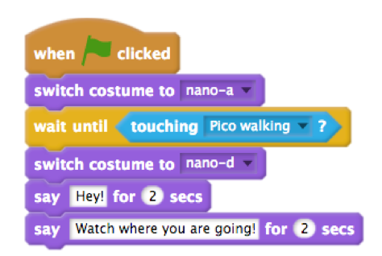

# Session Wrap-up

## Coding in Stage 3: ScratchMaths

### Mr Daniel Hickmott & Dr Elena Prieto-Rodriguez

#### Week 7: Interacting Sprites Part 1

##### 25th June 2018

---

# Recap: Interacting Sprites

- We started the third Module: *Interacting Sprites*
- Included learning about:
	- **Computational Concepts:** *Sequences*, *Loops*, *Events*, *Parallelism* and *Conditionals*
	- **Mathematics Concepts:** *Co-ordinates* and *Positive and Negative Numbers*.

---

# Homework Tasks

- Every week we will ask you to complete Homework
- Contributes towards your NESA accreditation hours (each week is 1 hour, for a total of 10 hours)
- After you have finished, please email me and let me know, so I can record this
- The tasks and links to complete this homework will always be available on the session page, under the *Homework* heading 	

---

# Week 4: Recreate this Animation

- [Homework Scene](https://drive.google.com/uc?export=view&id=14j_xri6AQ9PjI6ntL6rSdENcgQ2lxLBk)
    - Available to view and download from *Homework > Homework Scene Video* on Week 7 page as well
- Steps to complete the task are also in the *Week 7 Homework Task* document on Week 7 page

---

# Week 4: 6 Steps

1. Create a Project Titled "Homework Scene"
2. Change the Backdrop and Delete the Cat
3. Add the Characters and Animate Pico
4. Make Pico Walk Across the Stage
5. Stop the Animation at the End of the Scene
6. Add a Collision to the Scene

---

# 1. Create a Project Titled "Homework Scene"

---

# 2. Change the Backdrop & Delete the Cat

---

# 3. Add the Characters and Animate Pico

---

# 4. Make Pico Walk Across the Stage

---

# 5. Stop the Animation at the End of the Scene

---

# 6. Add a Collision to the Scene 

---

# Next Week: Interacting Sprites Part 2

- We will continue with activities from the *Interacting Sprites* Module
- You will learn more about *Conditionals* and *broadcasting*
- We will create stories with Coding, using **Computational Concepts**: *Sequences*, *Loops*, *Events*, *Parallelism* and *Conditionals*
- Also use **Mathematics** concepts: *Coordinates*, *Positive and Negative Numbers*, *Multiplication and Division* and *Probability*

---

# Journal

- Please complete a Journal entry before you leave today (should take 5-10 minutes)
- Link to Weekly Journal survey is on the session page, under the *Links* heading
- Or go to [hckmd.com/journal](hckmd.com/journal)
- **Before you leave: please Logoff and return Nametag**
