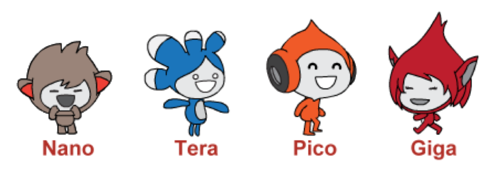

# Recap of

# Interacting Sprites Part 1

## Coding in Stage 3: ScratchMaths

### Mr Daniel Hickmott & Dr Elena Prieto-Rodriguez

#### Week 8: Interacting Sprites Part 2

##### 2nd July 2018

---

# Last Session

- Started working through ScratchMaths Module 3: *Interacting Sprites*
- *Module 3* involves creating projects that involves multiple Sprites interacting with each other
	- collisions, conversations and Stories
- Also showed the libraries of *Sprites*, *Sounds* and *Backdrops* in Scratch

---

# Module 3: Characters

- You will learn about the different libraries and how they can be used for *Digital Storytelling*

---

# Module 3: Interacting Sprites

- Includes learning about:
	- **Computational Concepts:** focus on *Events*, *Parallelism* and *Conditionals*
	- **Mathematics Concepts:** *Co-ordinates*, *Positive and Negative Numbers* and *Factors*
- Also reinforce **Computational Concepts** you have learned about previously: *Sequences*, *Loops* and *Operators*

---

# Module 3: Interacting Sprites

- Last week we worked on two Investigations from Module 2
    - *Animating Sprites* and *Encountering Conditions*
- We finished the first activity from *Encountering Conditions*: **Repeat Until...**
- Involved using *Conditionals*: repeating actions until a condition was true
- We will delve deeper into using *Conditionals* in today's activities

---

# Module 3: Interacting Sprites

- The *Success Criteria* for Module 3 are on the last page of the [Module 3 Teacher Materials](https://drive.google.com/uc?export=view&id=1ww1J57uwRmg2iU_dRcULoSf_psSLx0tS)
- There are 4 Investigations in Module 3
- In this session, we will aim to get the last 3 Investigations completed:
	- *Encountering Conditions* (3 Activities)
	- *Broadcasting Messages* (3 Activities)
    - *Interactive Stories* (1 Activity & 1 Extension Activity)
