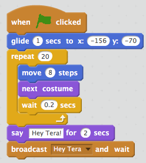

# Session Wrap-up

## Coding in Stage 3: ScratchMaths

### Mr Daniel Hickmott & Dr Elena Prieto-Rodriguez

#### Week 8: Interacting Sprites Part 2

##### 2nd July 2018

---

# Recap: Interacting Sprites

- We finished the third Module: *Interacting Sprites*
- Included learning about:
	- Some new **Computational Concepts:** *Events*, *Parallelism* and *Conditionals*
	- **Mathematics Concepts:** *Co-ordinates*, *Positive and Negative Numbers* and *Factors*
- Also reinforced **Computational Concepts** you have learned about previously: *Sequences*, *Loops* and *Operators*

---

# Digital Storytelling

- We did not create an entire story in Scratch
- It is possible to do this and there are many resources available to help you create *Digital Stories*
- Scratch has libraries of *Sprites*, *Backdrops* and *Sounds* built in
- You can also upload your own images (*Backdrops* and *Sprites*) and sounds

---

# Homework Tasks

- Every week we will ask you to complete Homework
- Contributes towards your NESA accreditation hours (each week is 1 hour, for a total of 10 hours)
- The tasks and links to complete this homework will always be available on the session page, under the *Homework* heading 	

---

# Week 8 Homework: Improving the Finding Pico Scene

- I have created the [Finding Pico Scene](https://scratch.mit.edu/projects/235094153/)
- A short story with three characters: *Giga*, *Tera* and *Pico*
- A video of the final scene is also available on the session page: [Finding Pico Homework Scene Video](https://drive.google.com/uc?export=view&id=1AbOfZjJ1VGgcBJZTeheJcEL1HMOIlPOm)
- The homework tasks involves improving the project and *debugging*

---

# Week 8 Homework: Tasks

1. Simplifying the Scripts
2. Changing repeat for moving *Giga* to other Sprites
3. Changing repeat for moving *Giga* off right-side of Stage
4. Debugging a problem: why doesn't *Pico* say hello?
5. Share the project and add it to the *Week 8 Homework Class Studio*
6. Complete the [Week 8 Homework Form](https://goo.gl/forms/2qr89dPnaIeB19aG2)

---

# 1. Simplifying the Scripts

---

# 2. Changing repeat to move Giga to other Sprites

- How would you change the *repeat* block to a *repeat until* block?

---

# 3. Changing repeat to move Giga off right-side of Stage

- How would you change the *repeat* block to use a *repeat until* block, by using *Giga's x position* and an *Operators* block?

---

# 4. Debugging a problem: why doesn't Pico say hello?

- In the [Finding Pico Homework Scene Video](https://drive.google.com/uc?export=view&id=1AbOfZjJ1VGgcBJZTeheJcEL1HMOIlPOm) *Pico* turns around and says: "Hey Giga!"

- Why doesn't he say: "Hey Giga!" in the remixed project and how can you fix this?

---

# 5 and 6: Sharing Project and Complete the Form

- Once you have completed the changes and fixed the problem, share the project and add it to the *Week 8 Homework Class Studio*
- Complete the [Week 8 Homework Form](https://goo.gl/forms/2qr89dPnaIeB19aG2)
	- *Homework > Week 8 Homework Form Link* on Week 8 page
- Submitting the form will send me an email - **so don't worry about sending me an email about the Week 8 homework when you complete it**

---

# In Week 9: Exploring Mathematical Relationships Part 1

- After the 2 weeks break, we will start the *Exploring Mathematical Relationships* module
- *Exploring Mathematical Relationships* is the 5th module in ScratchMaths (we are skipping *Module 4: Building with numbers*)
- **Mathematics Concepts**: *Proportionality*, *Ratios* and *Co-ordinates*
- New **Computational Concepts**: *Data* (using *Variables*)

---

# Journal

- Please complete a Journal entry before you leave today (should take 5-10 minutes)
- Link to Weekly Journal survey is on the session page, under the *Links* heading
- Or go to [hckmd.com/journal](hckmd.com/journal)
- **Before you leave: please Logoff and return Nametag**
