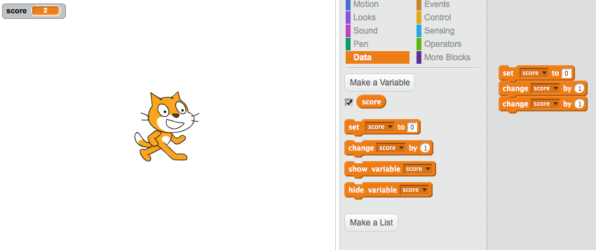

# Introduction to

# Exploring Mathematical Relationships

## Coding in Stage 3: ScratchMaths

### Mr Daniel Hickmott & Dr Elena Prieto-Rodriguez

#### Week 9: Exploring Mathematical Relationships Part 1

##### 23rd July 2018

---

# Before the Break

- Before the break we worked through the *Interacting Sprites* module
- Activities that involved the creation and editing of *Digital Stories*
- Learned about *Events*, *Parallelism* and *Conditionals*
- Also used positioning and co-ordinates for making the *Sprites* move around the *Stage*

---

# Finding Pico Scene

- The Week 8 homework task was to remix a project that plays a *Digital Story*
    - Add a *custom block* to simplify the scripts
    - Use *conditionals* with *repeat until* block 
    - Fixes a problem with missing blocks
- [An example of the Finding Pico story that has been extended](https://scratch.mit.edu/projects/235890689/)

---

# Notes for Week 9 & 10

- Week 9 and 10 sessions will be 5pm - 7pm
- Next week's session will be the last of the program
- In Week 10 session I will ask you to complete a survey, similar to the Week 1 survey
- I can also do an extra hour or so in Week 10
- **Please let me know if you can't make Week 10 session**

---

# Homework & Accreditation

- If you have completed all of the tasks and attended/caught up all of the sessions, I will ask the office staff to process your accreditation hours asap
- I am overseas from August 18 - September 12, **I am planning to finalise hours and completed homework tasks by September 17**
- We will send out certificates around September 17 as well, please let me know if you need the certificate before then

---

# Before we move on...

- Do you have any questions about the next 2 weeks?
- Or questions about *Stage 2* of the project?
- In the survey in Week 10 session, we will ask if you are willing to participate in:
    - *Interviews* (at the uni, school or over the phone)
    - *Observations* (at your school)

---

# Module 5: Exploring Mathematical Relationships

- This week we will start *Module 5: Exploring Mathematical Relationships*
- We have skipped *Module 4: Building with Numbers*
- The reasons we will do *Module 5* instead of *4*:
    - Focuses on *User Input* and *Variables*
    - Builds on a lot of the concepts in the activities that we have already done (e.g. *pen* tool and *co-ordinates*)

---

# User Input

- Have you used *User Input* in Scratch before?
- What are some examples of *User Input*?

---

# User Input

- Examples of *User Input* in Scratch include:
    - the *ask and wait* block
    - the *when key pressed* block
- This week we will use *User Input* to tell our Sprites the number, size and shape of patterns drawn with the *pen* tool

---

# Variables

- Used when storing or updating values in Coding
- When we want to keep track of things (numbers or text)
- Common example of using *variables* is in games for keeping track of scores
- Can you think of another example for where *variables* might be used? (hint: can you think of other ways *variables* could be used in a videogame?)

---

---

#  Module 5: Exploring Mathematical Relationships

- The format of the materials are slightly different for Modules 4, 5, 6 (e.g, no success criteria)
- There are 4 Investigations in Module 5
- In this session, we will aim to get these done:
	-  All 4 activities from Investigation 1 (*Polygon Fireworks Night Skyline*)
	-  The first activity (*Sequence of Squares*) from Investigation 2 (*Mathematically Similar Rectangles*)
