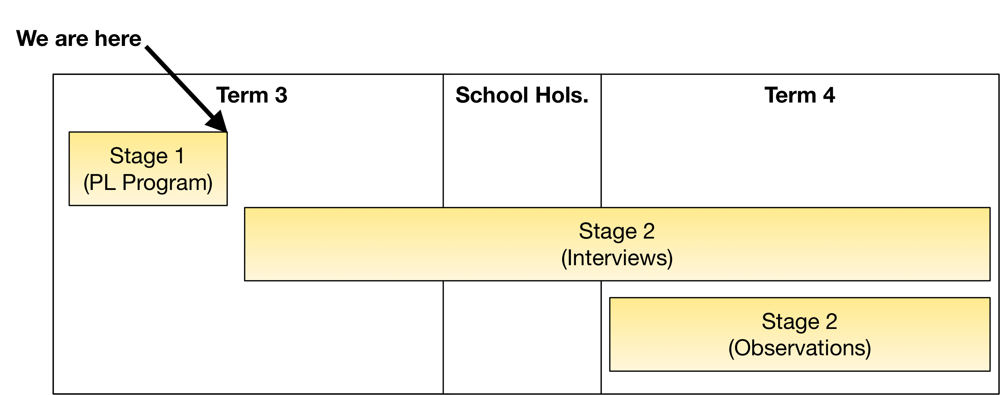

# End of Program

## Coding in Stage 3: Coding & STEAM

### Mr Daniel Hickmott & Mr Andrew Lyell

#### Week 10: Coding and Science and Technology Part 2

##### 3rd August 2018

---

# End of Program :disappointed:

- This is the last week of *Coding & STEAM*
- Before we start today, I am going to go over a few things about the research part of the program
- Like Week 1, we will ask you to complete a survey
- After this presentation and the survey, we will continue with some activities
- I can stay around for 30-60 mins at the end

---

# Research

- This Professional Learning (PL) program is part of my PhD research project
- The purpose is to help understand how Stage 3 teachers learn and teach Coding and Computational Thinking
- We hope this research helps other PL providers implement PL that is useful and relevant to teachers
- Important as *algorithms* and *Coding* are now included in the new Science & Technology K-6 syllabus

---

# Coding in Stage 3: PL Program

- *Professional Learning Program*
- 10 after-school sessions here in the lab
- NESA Accredited for 30 hours:
	- 10 x 2 hour sessions
	- 10 x 1 hour weekly homework tasks 
- *Surveys*: beginning and end
- *Weekly journals*

---

# Homework & Accreditation

- If you have completed all of the tasks and attended/caught up all of the sessions, I will ask the office staff to process your accreditation hours asap
- I am overseas from August 18 - September 12, **I am planning to finalise hours and completed homework tasks by September 17**
- We will send out certificates around September 17 as well, please let me know if you need the certificate before then

---

---

# Stage 2: Interviews (Optional)

- Could take place in Term 3 or 4 (whichever works best for you)
- 30-60 minute interview with questions about how you have been (or plan) to teach Coding
- Can be arranged to be conducted:
    - At the university
    - Over the phone or Skype
    - At your school

---

# Stage 2: Observations (Optional)

- Could take place in Term 4, after you have had a chance to try Coding with your students
- I would observe a lesson where you teach Coding to your students
- We would video record parts of the lesson but you and your students would not be identified
- The video would only be shared with my supervisors (and no-one else)

---

# This Session

- Now, we will ask you to complete an online survey in "Exam Conditions"
- Link is on the website (under the *Links* heading, towards the bottom): *End of Program Survey*
- Should take 30-40 minutes to complete
- If you finish early, try out the [Scratch 3 Beta](https://beta.scratch.mit.edu/)
- After that, we'll move onto some more *Micro:bit* activities (or *Video Sensing* if you would like to)