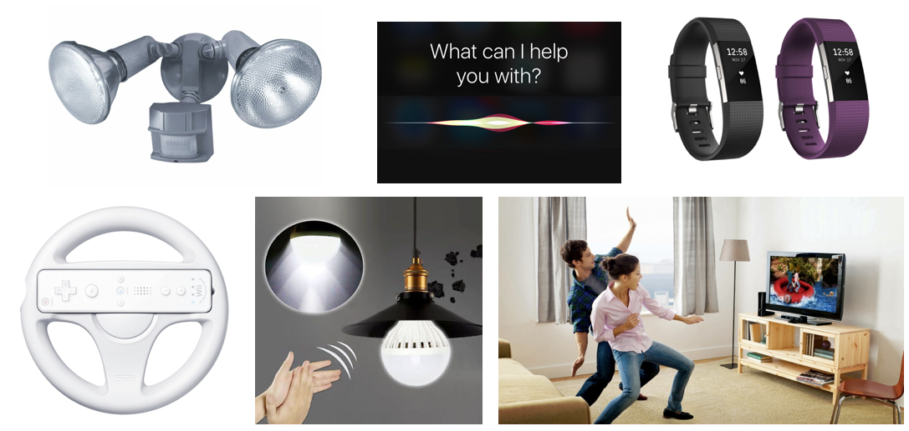

# Recap of 

# Coding and Science & Technology

# Part 1

## Coding in Stage 3: Coding & STEAM

### Mr Daniel Hickmott & Mr Andrew Lyell

#### Week 10: Coding and Science and Technology Part 2

##### 3rd August 2018

---

# Last Session

- We looked at ways that Coding and *Science and Technology* could be linked
- Learned about *Physical Computing* and did some hands-on activities with *Video Sensing* in Scratch and *BBC Micro:bits*

---

---

# Coding and Science and Technology

- Week 9 and 10 are about *Science and Technology*
- We will do a couple of activities from *Units 5 & 6*
- We will also work through some activities developed for another workshop we ran recently
- Our focus will be on *Technology*, rather than *Science*
- You will learn about different *Hardware / Devices* that could be used for conducting scientific experiments

---

 

*S*cience, *T*echnology, *E*ngineering, *A*rts and *M*athematics[^ ] 

[^ ]: [https://arraywhiz52446.wordpress.com/2015/05/28/k-2-makey-makey-project-part-i/](https://arraywhiz52446.wordpress.com/2015/05/28/k-2-makey-makey-project-part-i/)

---

# Units 5 & 6

- *Unit 5* is titled *Diving Deeper*
- *Unit 6* is titled *Hackathon*
- Both of these units have activities that are a lot more open-ended and self-directed than previous units
- For this program, we use a couple of activities from *Unit 5* but we won't use the *Hackathon* activities
- Links to these units are on the session webpage

---

# Hardware and Extensions

- *Unit 5: Diving Deeper* has an activity called *Hardware & Extensions*
    - Suggests using different *Physical Computing* devices: *Lego WeDo*, *MaKey MaKeys* and *PicoBoards*
- There is a large variety of different devices/hardware for teaching Coding with
- They vary in cost, ease-of-use and features
- In this session, we will use *BBC Micro:bits*

---

# Microbit + Scratch Videos

- Included on the session page
- [https://scratch.mit.edu/microbit](https://scratch.mit.edu/microbit)
- [Jumping with a Micro:bit (in Scratch 3)](https://www.youtube.com/watch?v=Mlno14YU5fw)
- [Tilting the Micro:bit (in Scratch 3)](https://www.youtube.com/watch?v=SUzzXCAY2v0)
- [A Piano = a Micro:bit and Spoons (in Scratch 3)](https://drive.google.com/uc?export=view&id=1bXJbUNVwaphCZIxDJCB6JZZv-qoQs0qx)
- [A Game Controller built with a Micro:bit (in Scratch 2)](https://www.youtube.com/watch?v=Tn6j6VAzu_s)

---

# Micro:bit Safety

- Put micro:bit back in the anti-static bag after use
- It's good practice to earth yourself before handling the device (by touching something metal)
- Only handle the micro:bit by its edges and avoid touching the components when the power is running
- Let us know if the micro:bit is or becomes damaged
- Further safety advice can be found [here](http://microbit.org/guide/safety-advice/)

---

# Microsoft MakeCode

- [MakeCode](https://makecode.microbit.org/) is one way to put Code onto *Micro:bits*
- An example of a *Hybrid Coding Environment* (combines *Blocks* and *Text*)
- You download a *.hex* file that has all of the Code
- The *Micro:bit* looks like a USB stick when plugged in
- You then copy the *.hex* file into the *Micro:bit* and it runs that Code

--- 

# Rest of the Session

- We have included a variety of different *Micro:bit* activities on the session page
- Work in groups of 2-3 and make the different projects
- You can try the different projects from *Code Club* etc, if you would like
- There are also links to *Micro:bit* teaching resources under the *Micro:bit Resources* heading
- You can also complete or extend the *Video Sensing* activities from Week 9