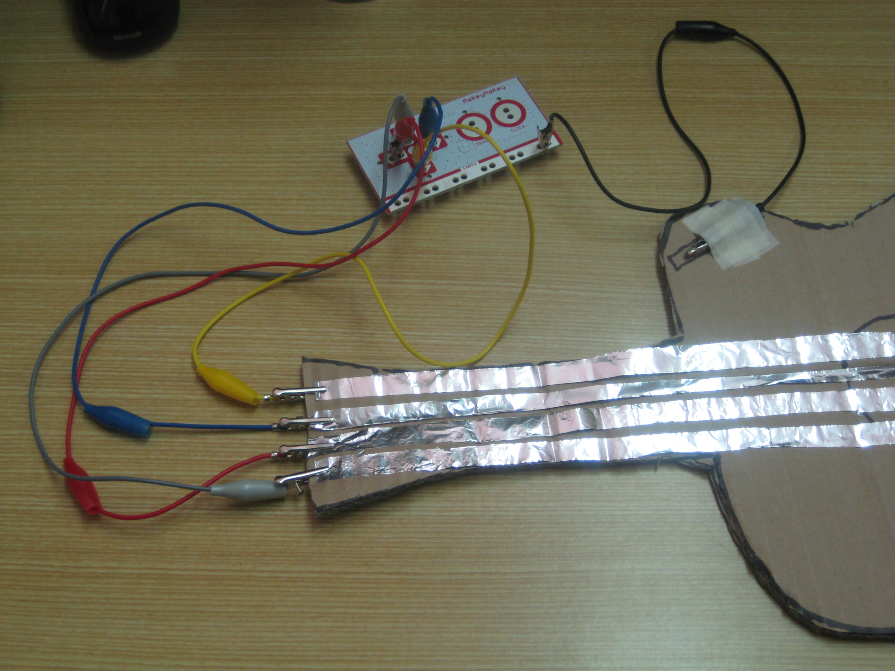

# Coding and Science & Technology

# Part 1

## Coding in Stage 3: Coding & STEAM

### Mr Daniel Hickmott & Mr Andrew Lyell

#### Week 9: Coding and Science and Technology Part 1

##### 27th July 2018

---

# Before the Break

- Before the break we completed the two *Coding and Mathematics* sessions
- Activities from *Unit 4* of the *Creative Computing Guide* (*Games*)
    - *Starter Projects*, *Score*
    - *Debug Its*, *Interactions*
- Learned about more **Computational Concepts**: *Operators*, *Conditionals* and *Data*

---

# Interactions Puzzles: #4, #5 and #6

- [Puzzle #4: Different Colours, Different Notes](https://scratch.mit.edu/projects/237207117/)
- [Puzzle #5: Excuse Me!](https://scratch.mit.edu/projects/236720163/)
- [Puzzle #6: Dog Scared of the Cat](https://scratch.mit.edu/projects/237132052/)

---

# Notes for Week 9 & 10

- Week 9 and 10 sessions are at same time and place
- Next week's session will be the last of the program
- In Week 10 session I will ask you to complete a survey, similar to the Week 1 survey
- I can also do an extra hour or so in Week 10
- **Please let me know if you can't make Week 10 session**

---

# Homework & Accreditation

- If you have completed all of the tasks and attended/caught up all of the sessions, I will ask the office staff to process your accreditation hours asap
- I am overseas from August 18 - September 12, **I am planning to finalise hours and completed homework tasks by September 17**
- We will send out certificates around September 17 as well, please let me know if you need the certificate before then

---

# Before we move on...

- Do you have any questions about the next 2 weeks?
- Or questions about *Stage 2* of the project?
- In the survey in Week 10 session, we will ask if you are willing to participate in:
    - *Interviews* (at the uni, school or over the phone)
    - *Observations* (at your school)

---

# Coding and Science and Technology

- Week 9 and 10 are about *Science and Technology*
- We will do a couple of activities from *Units 5 & 6*
- We will also work through some activities developed for another workshop we ran recently
- Our focus will be on *Technology*, rather than *Science*
- You will learn about different *Hardware / Devices* that could be used for conducting scientific experiments

---

# Units 5 & 6

- *Unit 5* is titled *Diving Deeper*
- *Unit 6* is titled *Hackathon*
- Both of these units have activities that are a lot more open-ended and self-directed than previous units
- For this program, we use a couple of activities from *Unit 5* but we won't use the *Hackathon* activities
- Links to these units are on the session webpage

--- 

# Unit 5: Diving Deeper

- Some of the *Unit 5* activities include:
    - *Round Two*
    - *Advanced Concepts:* *Video Sensing* and *Cloning*
    - *Hardware Extensions*
    - *Activity Design* and *My Debug It*

---

# Unit 6: Hackathon

- A Unit of activities to assist you to run a *Hackathon*
- *Hackathons* are usually run over a couple of days and involve creating a project that addresses some problem
- Page 112 has a diagram of the sequence of activites that could be used for running the *Hackathon*
- Students would develop the project *iteratively*, making changes to the plans as the project progressed

--- 

# Unit 6: Hackathon

- May not be feasible to run a *Hackathon* in your school
- Some schools may run *Genius Hours* or similar times for students to work on their own projects
- We (unfortunately) won't be able to include a similar activity in this program
- Hopefully what you have learned in Scratch (and with Microbits today and next week) gives you some ideas for larger and more open-ended student projects

--- 

# Week 9 and 10 Sessions: Physical Computing

- In Week 9 and 10, we will focus on *Physical Computing*
- What is *Physical Computing*?

---

# Physical Computing

*"Physical Computing is an approach to computer-human interaction design that starts by considering how humans express themselves physically… In physical computing, we take the human body and its capabilities as the starting point, and attempt to design interfaces, both software and hardware, that can sense and respond to what humans can physically do."*

- [Tom Igoe (2014)](https://itp.nyu.edu/physcomp/)

---

---

# Physical Computing in K-6

- [Scratch + Video Sensing](https://www.youtube.com/watch?v=h_1YafmZD4c)
- [Scratch + Makey Makeys](https://www.youtube.com/watch?v=ntBSwn_8wno)
- [Microbits](https://www.youtube.com/watch?v=Wuza5WXiMkc)
- Well suited to *STEAM* projects (*S*cience, *T*echnology, *E*ngineering, *A*rts and *M*athematics)

---

 

*S*cience, *T*echnology, *E*ngineering, *A*rts and *M*athematics[^ ] 

[^ ]: [https://arraywhiz52446.wordpress.com/2015/05/28/k-2-makey-makey-project-part-i/](https://arraywhiz52446.wordpress.com/2015/05/28/k-2-makey-makey-project-part-i/)

---

# Science and Technology Outcomes

- **ST3-1WS-S:** plans and conducts scientific investigations to answer testable questions, and collects and summarises data to communicate conclusions
    - You can collect data with *Micro:bits'* sensors
- **ST3-3DP-T:** defines problems, and designs, modifies and follows algorithms to develop solutions
    - You will develop *digital solutions* in Scratch

---

# Science and Technology Outcomes

- **ST3-2DP-T:** plans and uses materials, tools and equipment to develop solutions for a need or opportunity
    - *Micro:bits* projects combine *hardware* and *software*
- **ST3-11DI-T:** explains how digital systems represent data, connect together to form networks and transmit data
    - *Micro:bits* can be connected to other *Micro:bits* and data can be transmitted between them

---

# Video Sensing in Scratch

- Open the [Video Sensing Activity](https://drive.google.com/uc?export=view&id=175uGJ7VJ6qxH4jMYJVKcmqkEHBRHGBXQ) from the session page
- Remix the *Video Sensing Starter Project* from the *STEAM S&T Video Sensing* Class Studio
- Try clicking and changing the blocks in the project
- Add the blocks from the activity into your project
- What happens when you move your hand/s near the drum?

---

# Cloning in Scratch

- Open the [Cloning Activity](https://drive.google.com/uc?export=view&id=1utgzZFOCVrBMlEKLSXPNZDVNkCH69O0q) from the session page
- Remix the *Bubble Cloning Starter Project* from the *STEAM S&T Cloning* Class Studio
- Have a look at the tasks that are in the comments (the yellow box) and try completing them
- The last two tasks combine *Video Sensing* & *Cloning*
- If you finish those tasks, ask us about the Magic Cat

---

# The Magic Cat

- For this project you will need some post-it notes to hold in front of the webcam
- You may have to adjust the colours in the *touching color* blocks as well
- Why have we used a large black square for one of the Sprites?
- What does the *set ghost effect to 99* block do?

--- 

# Hardware and Extensions

- *Unit 5: Diving Deeper* has an activity called *Hardware & Extensions*
    - Suggests using different *Physical Computing* devices: *Lego WeDo*, *MaKey MaKeys* and *PicoBoards*
- There is a large variety of different devices/hardware for teaching Coding with
- They vary in cost, ease-of-use and features
- In this session, we will use *BBC Micro:bits*

---

# The BBC Micro [^  ]

 

[^  ]: [https://www.retromobe.com/2016/05/acorn-bbc-master-1986.html](https://www.retromobe.com/2016/05/acorn-bbc-master-1986.html)

---

# The BBC Micro:bit [^   ]

[^   ]: [Deezen: One Million UK Children to get Free BBC Micro Bit](https://www.dezeen.com/2015/07/10/one-million-uk-children-to-get-free-bbc-micro-bit-technology-will-save-us/)

---

# Why Micro:bit?

- Relatively cheap (around $20-30 each)
- Lots of resources available suitable for K-6 (likely due to English schools having access to them)
- You can just need the *Micro:bit*, a Computer and an internet connection (no need to install extra software)
- Has sensors, buttons, bluetooth & an LED display, which similarly priced devices often don't have
- Can be used as a controller in *Scratch 3* via bluetooth

---

# Micro:bit Components [^    ]

[^    ]: [http://microbit.org/guide/features/](http://microbit.org/guide/features/)

---

# Micro:bit Safety

- Put micro:bit back in the anti-static bag after use
- It's good practice to earth yourself before handling the device (by touching something metal)
- Only handle the micro:bit by its edges and avoid touching the components when the power is running
- Let us know if the micro:bit is or becomes damaged
- Further safety advice can be found [here](http://microbit.org/guide/safety-advice/)

---

# Microsoft MakeCode

- [MakeCode](https://makecode.microbit.org/) is one way to put Code onto *Micro:bits*
- An example of a *Hybrid Coding Environment* (combines *Blocks* and *Text*)
- You download a *.hex* file that has all of the Code
- The *Micro:bit* looks like a USB stick when plugged in
- You then copy the *.hex* file into the *Micro:bit* and it runs that Code

--- 

# Making an Interactive Badge

- An activity to introduce the use of *Micro:bits*
- You will make an "interactive badge"
- The LED display will change when different buttons are pressed
- Involves using *Sequences*, *Events* and *Loops* in [MakeCode](https://makecode.microbit.org/)

---

# Making a Dice

- An activity where you turn the *Micro:bit* into a *Dice*
- You will shake the *Micro:bit* and a random number (between 1 and 6) will be shown on the LED display
- Involves using *Sequences*, *Events*, *Operators*, *Data* and *Loops* in [MakeCode](https://makecode.microbit.org/)
- If you finish this quickly, try some of the activities in the *Micro:bit Extension Activities* section of the session page

---

# Discussion

- What *Computational Concepts* did you apply when creating the programs for the *Micro:bits*?
- Did you try any of the *Micro:bit Extension Activities*?
- Was [MakeCode](https://makecode.microbit.org/) different to Scratch? How so?
- Is there similarities between [MakeCode](https://makecode.microbit.org/) and Scratch?
- If you have tried other *Physical Computing* devices, how do they compare to *Micro:bits*?